# AYUVISTA - Product Architecture Specification

## 1. System Overview & Mission
**AYUVISTA** is a unified clinical research, clinical trial management (CTMS), and pharmacovigilance (PV) platform purpose-built for the **All India Institute of Ayurveda (AIIA)**, an autonomous apex institute under the Ministry of Ayush, Government of India.

AIIA conducts and coordinates extensive clinical studies, classical formulations trials, integrative medicine investigations, and safety monitoring. AYUVISTA provides a single pane of glass for portfolio governance, operational oversight, site coordination, participant tracking, regulatory compliance (CTRI, IEC/Ethics), and safety monitoring (AE/SAE reporting with pharmacovigilance signals).

> **Important Honesty Notice**: This platform is an enterprise-grade prototype designed for innovation and demonstration environments. Real-world regulated institutional systems (e.g., live CTRI portal, ABDM health exchanges, hospital HIS, licensed MedDRA/WHO Drug dictionaries, production 21 CFR Part 11 compliant digital signatures) are connected via explicit, transparent **Sandbox / Demo Adapters**. The platform is architected with clean abstraction boundaries so that production connectors can plug in seamlessly.

---

## 2. Core Architectural Principles
1. **Modular Monolith**: Clean separation of domain modules (Studies, Sites, Participants, Visits, Monitoring, Deviations, Data Quality, Ethics, CTRI, PV/Safety, Interoperability, Audit) within a unified backend and unified SPA frontend. Avoids premature microservice distributed-system complexity while enforcing strict domain boundaries.
2. **Clinical Information Density**: Linear / Bloomberg-grade high-density, calm, and purposeful user interface. Designed for clinical research coordinators, principal investigators, and medical reviewers - compact data grids, clear status chips, drill-down drawer/modal workflows, keyboard navigable, zero frivolous gamification or generic dashboard templates.
3. **Defense-in-Depth Security & Role-Based Access (RBAC)**: Backend-enforced authorization guards at router and service level, JWT sessions, password hashing (bcrypt), input sanitization (Pydantic v2), and append-only audit logging.
4. **ALCOA+ Data Integrity & DPDP Alignment**: Attributable, Legible, Contemporaneous, Original, Accurate + Complete, Consistent, Enduring, Available. Strict synthetic de-identification (`SYN-Pxxxxx`) preserving patient privacy principles under India's Digital Personal Data Protection (DPDP) Act.
5. **Standardized Interoperability & Formats**:
   - **CDISC Suite**: CDASH-aligned collection models, SDTM-oriented domain tabulation (DM, AE, DS, SV, LB), ADaM-like analysis datasets, and Define-XML structural metadata exports.
   - **HL7® FHIR® R4**: Standard resource transformations (`ResearchStudy`, `Patient`, `Encounter`, `Consent`, `Observation`, `AdverseEvent`) with transaction logs.
   - **Integration Sandbox Adapters**: Electronic Data Capture (EDC), Hospital Information System (HIS), Ayushman Bharat Digital Mission (ABDM), and CTRI sandbox connectors.

---

## 3. High-Level Architecture Diagram

```mermaid
graph TB
    subgraph "Presentation Layer (React + TypeScript + Vite + Tailwind)"
        UI_Nav[Navigation & RBAC Route Guard]
        UI_CC[Command Center & Portfolio Health]
        UI_Study[Study Workspace & Lifecycles]
        UI_Site[Site Management & Performance]
        UI_Part[Participant & Visit Tracker]
        UI_DQ[Data Quality Center & Query Engine]
        UI_Safety[Safety / PV Workspace & SAE Clock]
        UI_Ethics[Ethics & CTRI Milestone Hub]
        UI_Interop[Interoperability & CDISC Export]
        UI_Audit[Audit Explorer & ALCOA+ Inspector]
    end

    subgraph "API Gateway & Application Server (FastAPI + Pydantic v2)"
        Auth_MW[Auth & RBAC Middleware]
        Audit_MW[Append-Only Audit Interceptor]
        Risk_Eng[Rule-Based Operational Risk Engine]
        
        API_Studies["/api/v1/studies"]
        API_Sites["/api/v1/sites"]
        API_Participants["/api/v1/participants"]
        API_Visits["/api/v1/visits"]
        API_Monitoring["/api/v1/monitoring"]
        API_Deviations["/api/v1/deviations"]
        API_Queries["/api/v1/queries"]
        API_Safety["/api/v1/safety (AE/SAE/Signals)"]
        API_Ethics["/api/v1/ethics & /ctri"]
        API_Interop["/api/v1/interop (FHIR/EDC/HIS/ABDM)"]
        API_Export["/api/v1/exports (CDISC/SDTM/ADaM)"]
        API_Audit["/api/v1/audit"]
    end

    subgraph "Data & Storage Layer"
        DB[(SQLite / PostgreSQL Engine via SQLAlchemy 2.0)]
        ObjStore[Document & Evidence Store Abstraction]
    end

    subgraph "External Integration Sandboxes"
        M_CTRI[CTRI Sandbox Adapter]
        M_EDC[EDC Sandbox Adapter]
        M_HIS[Hospital HIS Adapter]
        M_ABDM[ABDM Health Repository Sandbox]
        M_Dict[Coding Dictionary Adapter]
    end

    UI_Nav --> Auth_MW
    Auth_MW --> API_Studies & API_Sites & API_Participants & API_Safety & API_Ethics & API_Interop & API_Export
    Audit_MW -.-> DB
    API_Studies --> DB
    API_Safety --> DB & M_Dict
    API_Interop --> M_CTRI & M_EDC & M_HIS & M_ABDM
    API_Export --> ObjStore
```

---

## 4. Frontend Architecture
- **Framework**: React with TypeScript, bundled via Vite.
- **Routing**: React Router with role-aware route guards (`RoleGuard`), breadcrumb provider, and layout wrappers.
- **State & Data Fetching**: TanStack Query (React Query) for optimistic caching, server-state invalidation, and polling.
- **UI Components**: Modern, accessible UI built with Tailwind CSS, Lucide icons, custom data table components (with multi-column sorting, facet filters, search, and pagination), sheet drawers, and dialog primitives.
- **Visualizations**: High-performance charting (Recharts) with clinical color palettes:
  - Recruitment S-curves (Actual vs Target vs Lag)
  - SAE reporting deadline countdown timers
  - Site performance radar / bar charts
  - Safety signal frequency vs expected thresholds
  - Study operational risk breakdown (0-100 index)

---

## 5. Backend Architecture
- **Framework**: FastAPI (Python 3.12+), high-performance asynchronous API endpoints with auto-generated OpenAPI 3.1 schemas.
- **Data Model & ORM**: SQLAlchemy 2.0 with modern `Mapped` type annotations, support for SQLite (development/single-file zero-config setup) and PostgreSQL (production deployment).
- **Validation**: Pydantic v2 schemas for all requests, responses, and transformation contracts.
- **Authentication**: Stateless JWT access tokens signed with HMAC-SHA256, BCrypt password hashing, configurable session expiry.
- **Audit System**: Centralized interceptor logging `actor_id`, `role`, `action`, `entity_type`, `entity_id`, `before_state`, `after_state`, and `timestamp`. Read-only to end users.
- **Operational Risk Scoring Engine**: Configurable, deterministic calculation engine evaluating 6 weighted risk vectors:
  $$\text{Risk Score} = w_1 \cdot \text{RecruitmentLag} + w_2 \cdot \text{OpenQueries} + w_3 \cdot \text{OverdueMonitoring} + w_4 \cdot \text{Deviations} + w_5 \cdot \text{RegulatoryDeadlines} + w_6 \cdot \text{SafetyAlerts}$$

---

## 6. Adapter & Interoperability Layer
All external systems are decoupled behind interface contracts:
1. `CTRISandboxConnector`: Emulates protocol registration, prospective status validation, and milestone tracking.
2. `EDCSandboxAdapter`: Simulates scheduled batch synchronization of case report forms (eCRF), imported/exported records, and discrepancies.
3. `HISSandboxAdapter`: Simulates hospital EMR admissions, diagnostic labs, and encounter events for Ayurvedic clinical studies.
4. `ABDMSandboxAdapter`: Emulates Ayushman Bharat Digital Mission M1/M2/M3 milestone transactions (ABHA address lookup, consent artefact verification, FHIR bundle push).
5. `CodingDictionaryAdapter`: Synthetic MedDRA/WHO-Drug-like hierarchy for demo safety coding without unlicensed redistribution.

